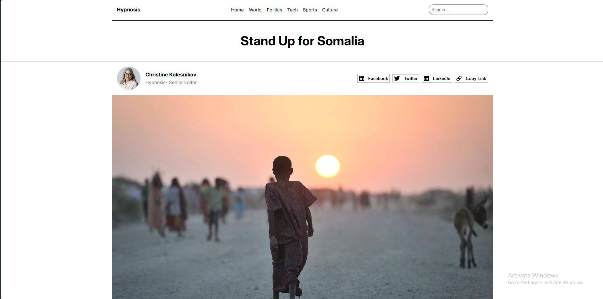
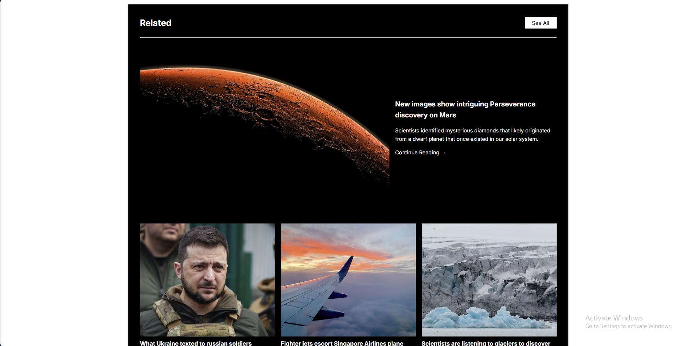

A responsive blog layout built with HTML, CSS, and JavaScript.
This project features a magazine‑style design with categories, styled posts, author details, share options, video/quote section, related articles, newsletter subscription, and a multi‑column footer.

---

## 🚀 Live Demo

👉 [View Website](https://blog-layout-lemon.vercel.app/)

---

## 📸 Screenshots

### Home Page



### Related Section



---

## 📌 Features

- Responsive grid layout (mobile‑first)

Header with logo, navigation, and search bar

Hero heading + author/share section

Full‑width hero image

Alternating image/text “About” sections

Video player + blockquote + description

Related articles section with featured + grid posts

Newsletter subscription form with validation

Multi‑column footer with categories and links

SEO meta tags + favicon

Hosted on Netlify/Vercel/GitHub Pages

---

## 🛠️ Technologies Used

- **HTML5** → semantic structure
- **CSS3** → Flexbox/Grid, responsive design, media queries
- **JavaScript** → search filter, interactivity

---

## 📂 Project Structure

Code
blog-layout/
│── index.html
│── style.css
│── script.js
│── assets/
├── hero.jpg
├── author.jpg
├── related1.jpg
├── article1.jpg
├── article2.jpg
├── article3.jpg
└── favicon.png

---

## 📖 How to Run Locally

1. Clone this repo:
   ```bash
   git clone https://github.com/Momna533/blog-layout
   Open index.html in your browser.
   ```

Customize content in index.html, styles in style.css, and scripts in script.js.

📧 Contact
Created by Momna Ijaz  
Frontend Developer & Freelancer

Email: [Your Email](momnadev533gb@gmail.com)
